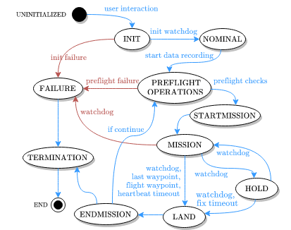

# CNS Flight Stack: Autonomy Engine

[](./LICENSE) [](https://doi.org/10.1109/LRA.2022.3196117)

Maintainer: [Alessandro Fornasier](mailto:alessandro.fornasier@aau.at)

- [Credit](#credit)
- [License](#license)
  * [Usage for academic purposes](#usage-for-academic-purposes)
- [Description](#description)
  * [Pre-Flight Checks](#pre-flight-checks)
  * [Mission Operation](#mission-operation)
  * [Data Clean Up](#data-clean-up)
  * [Error Handling](#error-handling)
  * [Interaction with the WatchDog Node](#interaction-with-the-watchdog-node)
  * [Configuration of the Autonomy Engine](#configuration-of-the-autonomy-engine)
  * [Parameter description](#parameter-description)

## Credit
This code was written by the [Control of Networked System (CNS)](https://sst.aau.at/cns), University of Klagenfurt.

## License
This software is made available to the public to use (_source-available_), licensed under the terms of the BSD-2-Clause-License with no commercial use allowed, the full terms of which are made available in the `LICENSE` file. No license in patents is granted.

### Usage for academic purposes
If you use this software in an academic research setting, please cite the
corresponding paper and consult the `LICENSE` file for a detailed explanation.

```latex
@article{cns_flightstack22,
    title        = {CNS Flight Stack for Reproducible, Customizable, and Fully Autonomous Applications},
    author       = {Scheiber, Martin and Fornasier, Alessandro and Jung, Roland and Böhm, Christoph and Dhakate, Rohit and Stewart, Christian and Steinbrener, Jan and Weiss, Stephan and Brommer, Christian},
    journal      = {IEEE Robotics and Automation Letters},
    volume       = {7},
    number       = {4},
    year         = {2022},
    doi          = {10.1109/LRA.2022.3196117},
    url          = {https://ieeexplore.ieee.org/document/9849131},
    pages        = {11283--11290}
}
```

---

## Getting Started
### Prerequesites
This package is part of the [CNS Flight Stack] and thus depends on the other packages of the flight stack:
- [CNS Flight Stack: Mission Sequencer]
- [CNS Flight Stack: Watchdog]
- [MavROS (CNS Version)]
- [PX4Bridge (CNS Version)]

Further the following libraries are required
- ROS1 noetic

### Build

As this is a ROS package, please build it within the catkin environment with

```bash
catkin build autonomy_engine
```
Please make sure the above mentioned dependencies are available in your workspace.

## Autonomy Engine Description
The autonomy engine is responsible for the overall mission operation. After launching the node, the autonomy will prompt the user for a predefined mission sequence. After the user confirmed a selection, the autonomy engine is responsible for the following tasks

  - Pre-Flight Checks
  - Mission Operation
  - Data Clean-Up
  - Error Handling

Errors that might occur during these steps are reported to the user depending on the severity. If the autonomy and consecutive nodes can solve an error without external action, a warning is published to the terminal.

### Pre-Flight Checks
Pre-Flight Checks concern all aspects that are necessary to perform a successful flight. The autonomy implements the logic and manages the sub-modules that are responsible for performing the checks, including:

- Communication with the WatchDog node to clarify that all ROS nodes are running, driver status are correct, and sensors provide measurements based on their defined rate. If these conditions are not met and the WatchDog node can not solve the issue, external action is required.

- Communication with sub-modules responsible for performing checks e.g. check the flatness of the platform before takeoff, or check the distance to the ground, etc.

- Communication with the state estimator to ensure that the provided estimation is healty.

- Finally, the autonomy displays the result of the checks, if all the checks succeeded the autonomy starts the data recording and communicates with the mission manager that the platform is ready for taking off.

### Mission Operation
During the mission the autonomy is responsible for handeling sensor failures and react based on the severity. The autonomy communicates with the watchdog and with the mission sequencer to ensure a safe flight. At the end of the mission, the autonomy communicates with the mission manager that the mission has ended and the platform is ready to land.

### Data Clean Up
After the mission, the autonomy triggers the end of the data recording which leads to a wait time till all data is written and was merged between the two embedded platforms.

### Error Handling
At any time after the Pre-Flight checks, the WatchDog node can communicate an error to the autonomy. The autonomy engine is responsible for triggering an action depending on the severity of the issue. As an example, a failure of the mission camera cant be tolerated and an emergency landing is triggered immediately. On the other side, a failure of the RealSense is not critical but inconvenient for data recording. Thus, the autonomy waits until the autonomy restarted the respective node and continues. However, if a maximum restart time of the node is reached and the error was not solved, the mission can be continued.

### Interaction with the WatchDog Node

The safety node a.k.a. watchdog is started by the Autonomy via service request. After this, the safety node will open two streams; the status stream which communicates changes in the status of the various watched sensors, and the action stream which is used by the autonomy engine to communicate actions to be performed to restore the nominal functionalities of a specific sensor.

Possible states for the status stream, are:

| Value | Status                        |
| ----- | ----------------------------- |
| 0     | Undefined Condition           |
| 1     | Nominal Condition             |
| 2     | Starting phase          	|
| 4     | Inconvenient Failure (defect) |
| 8     | Error        			|

Possible states for the action stream, are:

| Value | Status        |
| ----- | ------------- |
| 0     | No action     |
| 1     | Fix node      |
| 2     | Fix driver	|

### Configuration of the Autonomy Engine

A configuration file (yaml) has to be created for the autonomy engine. This configuration file specifies the mission to be loaded as well as the severity of the failures for each sensor.

```
missions:

  mission_1:
    description: "The first mission of the day"
    filepaths:
      - "/home/system/missions/first.csv"
    entities_actions:
      - ["px4_imu", "failure"]
      - ["px4_gps", "land"]
      - ["px4_mag", "hold"]
      - ["px4_bar", "hold"]
      - ["mission_cam", "land"]

  mission_2:
    description: "The last mission of the day"
    filepaths:
      - "/home/system/missions/last.csv"
    entities_actions:
      - ["px4_imu", "failure"]
      - ["px4_gps", "continue"]
      - ["px4_mag", "continue"]
      - ["px4_bar", "continue"]
      - ["mission_cam", "land"]
```

Every mission is specified in a mission file (csv) formatted as follows

```
x,y,z,yaw,holdtime
0,0,1.0,0,1
1,0,1.0,0,1
1,1,1.0,0,1
0,1,1.0,0,1
-1,1,1.0,0,1
-1,0,1.0,0,1
-1,-1,1.0,0,1
0,-1,1.0,0,1
1,-1,1.0,0,1
1,0,1.0,0,1
0,0,1.0,0,1
```

The ``holdtime`` column is optional, if not present the holdtime is set to 0 by default.

### Parameter description
The parameters of the launchfile are described here.

| Parameter | Description | Default value |
| --- | --- | --- |
| `config_filepath` | Path of the configuration file | ` ` |
| `activate_user_interface` | Boolean to activate the UI | `True` |
| `activate_watchdog` | Boolean to actiavate the watchdog | `False` |
| `activate_data_recording` | Boolean to actiavate data recording | `False` |
| `estimator_init_service` | Boolean to actiavate the estimator initialization service| `False` |
| `perform_takeoff_check` | Boolean to perform takeoff checks | `False` |
| `perform_estimator_check` | Boolean to perform estimator health checks | `False` |
| `activate_landing_detection` | Boolean to actiavate landing detection | `False` |
| `inflight_sensors_init_service` | Boolean to actiavate inflight sensor initalization | `False` |
| `hover_after_mission_completion` | Boolean to actiavate hovering (instead of landing) after mission completion | `False` |
| `sequence_multiple_in_flight` | Boolean to sequence multiple mission in flight (without perform landing - preflight checks - takeoff in between missions) | `False` |
| `watchdog_heartbeat_topic` | Topic of the watchdog heartbeat message | `/watchdog/heartbeat` |
| `watchdog_status_topic` | Topic of the watchdog status message | `/watchdog/status` |
| `watchdog_action_topic` | Topic for a watchdog action message | `/watchdog/action` |
| `mission_sequencer_request_topic` | Topic for a mission sequencer request message | `/missionsequencer/request` |
| `mission_sequencer_response_topic` | Topic of the mission sequencer response message | `/missionsequencer/response` |
| `mission_sequencer_waypoints_topic` | Topic to communicate waypoints to the mission sequencer | `/missionsequencer/waypoints` |
| `landing_detection_topic` | Topic of the landing detection message | `/toland/is_landed` |
| `watchdog_start_service_name` | Service name to start the watchdog | `/watchdog/service/start` |
| `data_recrding_service_name` | Service name to start and stop data recording | `/datarecording/record` |
| `takeoff_service_name` | Service name to request takeoff checks | `/toland/service/takeoff` |
| `estimator_supervisor_service_name` | Service name to request estimator supervision | `/estimator_supervisor/supervise` |
| `estimator_init_service_name` | Service name to initialize state estimation | `/estimator/init` |
| `inflight_sensor_init_services_name` | Names of services that has to be called after takeoff (Array of service names) | `[]` |
| `watchdog_rate_Hz` | Framerate of watchdog heartbeat | `1.0` |
| `watchdog_startup_time_s` | Time the watchdog will check sensors at initialization (in seconds) | `15` |
| `watchdog_heartbeat_timeout_multiplier` | multiplier to set the maximum allowed time without receiving watchdog heartbeat | `2.0` |
| `maximum_flight_time_min` | Maximum allowed flight time (in minutes) | `10` |
| `fix_timeout_ms` | Maximum time to fix an issue (in milliseconds) | `1500` |
| `preflight_fix_timeout_ms` | Maximum time to fix an issue in preflight stage (in milliseconds) | `2500` |
| `data_recording_delay_after_failure_s` | Time to wait before stopping data recording in case of failure (in seconds) | `5` |
| `mission_id_no_ui` | Mission to be performed in case of no UI | `1` |
| `logger_filepath` | Path of the logger file | ` ` |
| `trajectory_dir` | Global path to trajectories directory | `<path_to_autonomy_engine>/config/trajectories` |

## Architecture

Please refer to the [academic paper] for further insights of the Autonomy Engine.



## Known Issues

None at this point in time, please submit an issue request using the git interface if any issues arise.

## Package Layout

```[console]
/path/to/autonomy_engine$ tree -L 3 --noreport --charset unicode
.
|-- CMakeLists.txt
|-- config
|   |-- config_template.yaml
|   `-- trajectories
|       `-- template_dir
|-- docs
|   `-- resources
|       `-- state_diagram_autonomy.png
|-- include
|   |-- autonomy_core
|   |   |-- autonomy_defs.h
|   |   |-- autonomy.h
|   |   |-- autonomy_options.h
|   |   `-- mission.h
|   |-- spdlog
|   |   `-- ...
|   |-- state_machine
|   |   |-- state.h
|   |   `-- states
|   |-- timer
|   |   `-- timer.h
|   |-- utils
|   |   |-- colors.h
|   |   |-- except.h
|   |   |-- format.h
|   |   |-- logger.h
|   |   `-- utilities.h
|   `-- waypoints_parser
|       `-- waypoints_parser.h
|-- launch
|   `-- autonomy.launch
|-- LICENSE
|-- msg
|   `-- LogMessage.msg
|-- package.xml
|-- README.md
`-- src
    |-- autonomy_core
    |   |-- autonomy.cpp
    |   `-- mission.cpp
    |-- autonomy_node.cpp
    |-- state_machine
    |   |-- state.cpp
    |   `-- states
    |-- timer
    |   `-- timer.cpp
    `-- waypoints_parser
        `-- waypoints_parser.cpp

```

<!-- LINKS: -->
[CNS Flight Stack]: https://github.com/aau-cns/flight_stack
[CNS Flight Stack: Mission Sequencer]: https://github.com/aau-cns/mission_sequencer
[CNS Flight Stack: Watchdog]: https://github.com/aau-cns/ros_watchdog
[MavROS (CNS Version)]: https://github.com/aau-cns/mavros
[PX4Bridge (CNS Version)]: https://github.com/aau-cns/PX4-Autopilot
[academic paper]: https://ieeexplore.ieee.org/document/9849131
