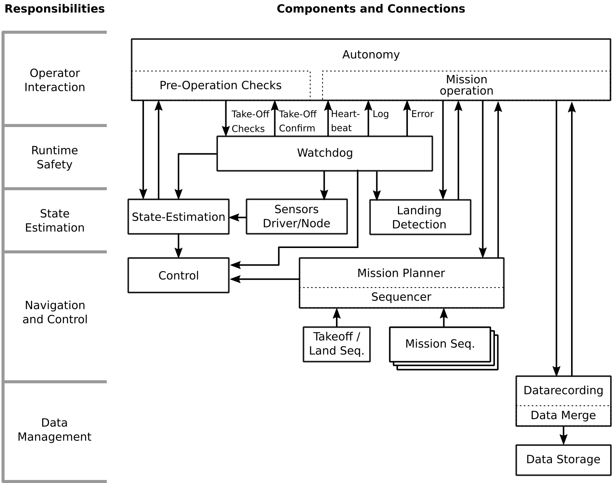
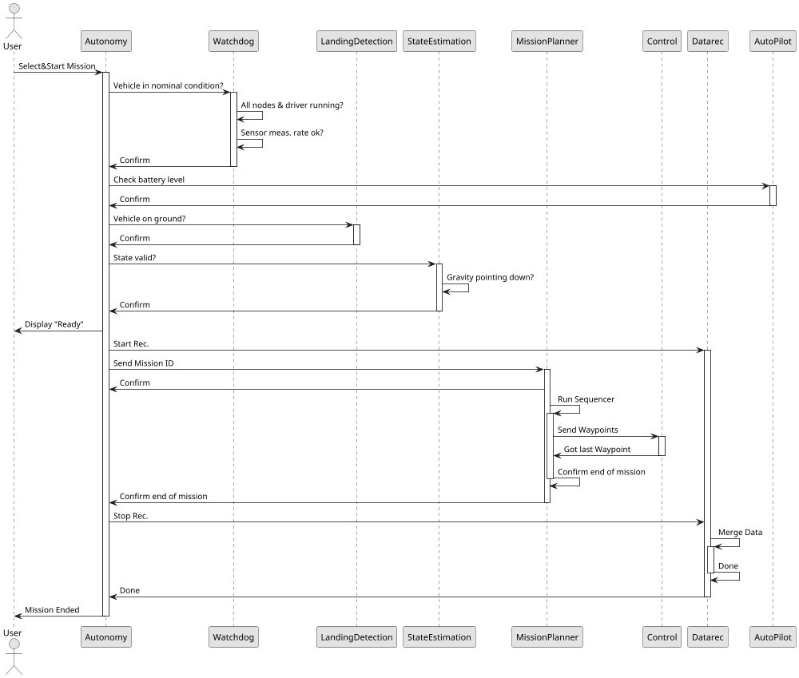
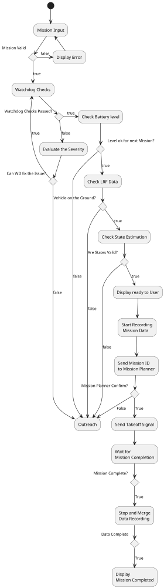

# AMAZE Autonomy

Maintainer: Alessandro Fornasier @alfornasier; Christian Brommer @chrbrommer

[[_TOC_]]

## Description
The autonomy engine is responsible for the overall mission operation. After launching the node, the autonomy will prompt the user for a predefined mission sequence. After the user confirmed a selection, the autonomy engine sequences through four main states:

  - Pre-Flight Checks
  - Mission Operation
  - Data Clean-Up
  - Error Handling

Errors that might occur during these steps are reported to the user depending on the severity. If the autonomy and consecutive nodes can solve an error without external action, a warning is published to the terminal.

### Pre-Flight Checks
Pre-Flight Checks concern all aspects that are necessary to perform a successful flight. This includes:
- Communication with the WatchDog node to clarify that all ROS nodes are running, driver status are correct, and sensors provide measurements based on their defined rate. If these conditions are not met and the WatchDog node can not solve the issue, external action is required.

- Checking sensor conditions e.g. the current distance measurement of the Laser Range Finder to determine that the vehicle is placed properly on the ground.

- Checking with the state estimator that the gravity vector points downwards in the vehicle frame. This should ensure that the angles at which the vehicle is placed are within limits for the takeoff.

- At the end, the autonomy displays the result of the checks and continues with the mission generation.

### Mission Operation
The mission operation starts the data recording and ensures that sufficient time has passed before the takeoff.

After this step, the mission operation sends the mission ID to the Mission Planner, which builds the mission waypoint file and sends it to the controller. At this point, the takeoff is performed.

At the end of this state, the mission planner will respond and confirm that the vehicle has landed.

### Data Clean Up
The autonomy triggers the end of the data recording which leads to a wait time till all data is written and was merged between the two embedded platforms. After this, the mission has ended, which will also be displayed to the user.

### Error Handling
At any time after the Pre-Flight checks, the WatchDog node can communicate an error to the autonomy. The autonomy engine is responsible for triggering an action depending on the severity of the issue. As an example, a failure of the mission camera cant be tolerated and an emergency landing is triggered immediately. On the other side, a failure of the RealSense is not critical but inconvenient for data recording. Thus, the autonomy waits until the autonomy restarted the respective node and continues. However, if a maximum restart time of the node is reached and the error was not solved, the mission can be continued.

## Error Cases and Decisions

### PX4 Sensors

For the PX4, generally, no restart is allowed. Otherwise the vehicle will not be controlable.

| Sensor       | Action | Severity |
| ------------ | ------ | -------- |
| GPS          |        | low      |
| IMU          |        | highest  |
| Magnetometer |        | moderate |
| Barometer    |        | moderate |

### All other Sensors
| Sensor           | Action                  | Severity |
| ---------------- | ----------------------- | -------- |
| Mission Camera   | Emergency Landing       | Highest  |
| RealSense Camera | Wait for a limited time | Moderate |
| RealSense IMU    | No Restart              | Low      |
| LSM9DS1 IMU      | Wait for a limited time | Moderate |
| LRF              | Wait for a limited time | High     |

### Interaction with the WatchDog Node
**To be redefined - Work in progress**

The safety node a.k.a. watchdog, only starts if the Autonomy publishes a service request to determine if the system is ready for take-off. After this, the safety node will open two streams; the action service information which will communicate the latest and highest issue of the system which will determine the most likely action of the autonomy engine, and a system info with all 'delta' sensor informations.

Possible states for the action and info streams, are:

| Value | Description                   | Action | Info | Continue Mission |
| ----- | ----------------------------- | ------ | ---- | ---------------- |
| 1     | Nominal Condition             |        | x    | x                |
| 2     | Non-Critical Failure          |        | x    | x                |
| 4     | Inconvenient Failure          | x      | x    | x                |
| 8     | Severe Failure / Mission Hold | x      | x    |                  |
| 16    | Error / Mission Abort         | x      | x    |                  |

| Nominal Failure               | Description                                                  |
| ----------------------------- | ------------------------------------------------------------ |
| Nominal Condition             | The component is operating as intended                       |
| Non-Critical Failure          | The component has failed but is not system critical OR a frame rate is not as intended |
| Inconvenient Failure          | The component has failed and is not critical to the system but losing the data stream for recording is very inconvenient (e.g., the stereo camera). |
| Severe Failure / Mission Hold | A severe failure occurred, the safety node tries to restart the component, the mission should hold meanwhile. |
| Error / Mission Abort         | A severe failure could not be resolved, the system needs to land immediately |

## System Block-Diagram

## Autonomy Sequence

## Autonomy Activity Diagram

